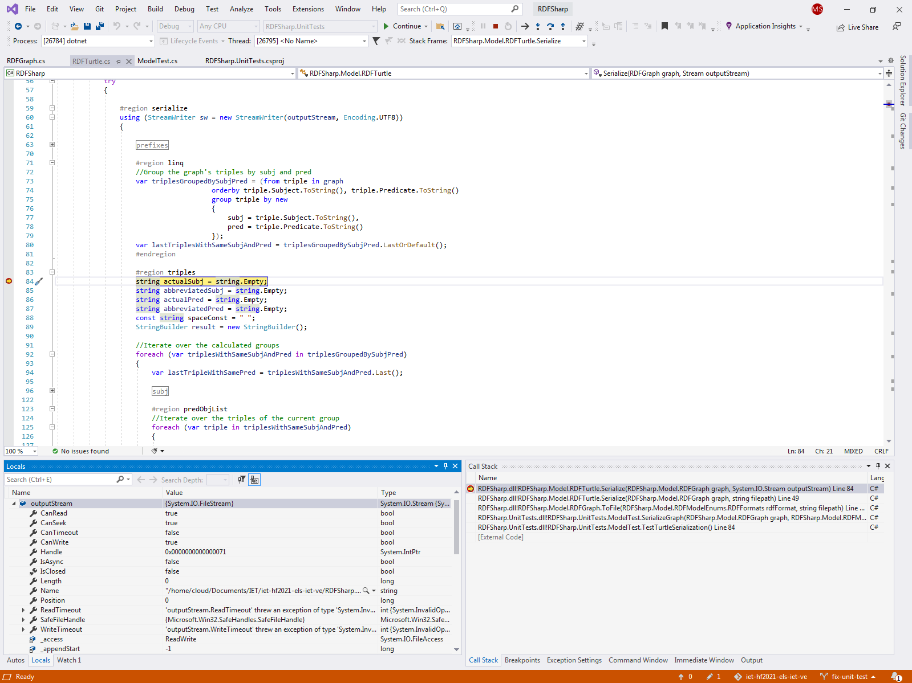

# Egységtesztek készítése, kódlefedettség mérése

A feladatban készítettünk egy adag tesztet, és lemértük, hogy az eredeti projekt mekkora részét tudtuk vele lefedni.

A teszteléshez a standard UnitTest-et, a kód lefedettségének méréséhez pedig a [ReportGenerator](https://github.com/danielpalme/ReportGenerator)-t használtuk.


A jelentésben megtekinthetőek az egyes osztályok sorai, illetve névterekbe csoportosítva a kódlefedettség

A kódsoroknak kb. 15%-át sikerült lefedni, az ágaknak pedig kb. 10%-át. Tesztből sosem lehet eleget írni, de egy alapnak talán megfelelő.

## Hiba azonosítása, javítása

Találtunk egy hibát a eredeti projektben, ami az volt, hogy Linux rendszeren futva a Turtle szerializálás nem működött megfelelően.

A probléma forrásának megtalálásához a Visual Studio-nak a  [Remote Debugging](https://docs.microsoft.com/en-us/visualstudio/debugger/remote-debugging-dotnet-core-linux-with-ssh?view=vs-2019) eszközét lehet használni, amivel van lehetőség SSH-n keresztül csatlakozni egy Linuxos géphez. Így a Linuxon a tesztet elindítva, Visual Studio-ból rá lehet csatlakozni a teszt process-éhez, és azt debuggolni, mint ha csak a lokális gépen debuggolnánk a kódot.



A probléma gyökere az volt, amikor a sorvégi karaktert kelett kijavítani, akkor az algoritmus csak visszalépett 4 karaktert, és a ```;```-ot kicserélte ```.```-ra. Ez Windows-on jól működött, de Linuxon csak 3-at kell visszalépni, mert ott a sorvége nem 2, hanem csak 1 karakter hosszú. Ebből kifolyólag az algoritmus nem javította ki a ```;```-ot, és így a kiírt fájl tartalma formailag helytelen lett.

Ennek egy lehetséges megoldása az, hogy továbbra is 4 karaktert lépünk vissza, de 2 karakter hosszúságban keressük a ```;```-t. Így mind a két rendszeren meg fogja találni, majd azt kicserélni. Ezzel sikerült is kijavítani a beazonosított hibát.

## Tanulság
Gyakran (esetünkben is) sokkal több időt vesz el a hiba forrásának megtalálása, mint annak a kijavítása. Ezért is érdemes CI-t használni a fejlesztés során, hogy az ilyen kis hibákat könnyen észre lehessen venni, és egyből javítani.