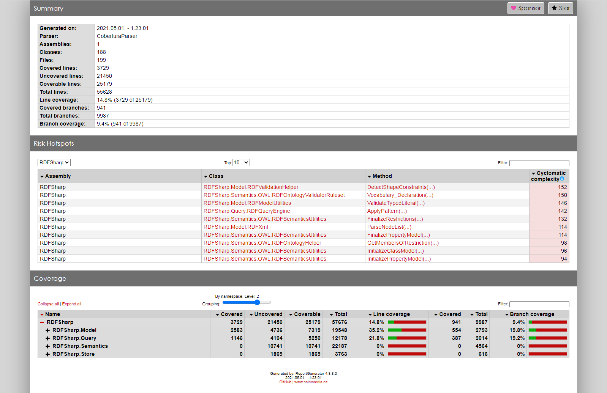

# Feladat: Egységtesztek készítése, kódlefedettség mérése

A feladatban készítettünk egy adag tesztet, és lemértük, hogy az eredeti projekt mekkora részét tudtuk vele lefedni.

A teszteléshez a standard UnitTest-et használtuk, a kód lefedettségének méréséhez pedig a [ReportGenerator](https://github.com/danielpalme/ReportGenerator)-t használtuk.

A jelentésben megtekinthetőek az egyes osztályok sorai, illetve névterekbe csoportosítva a kódlefedettség

A kódsoroknak kb. 15%-át sikerült lefedni, az ágaknak pedig kb. 10%-át. Tesztből sosem lehet eleget írni, de egy alapnak talán megfelelő.