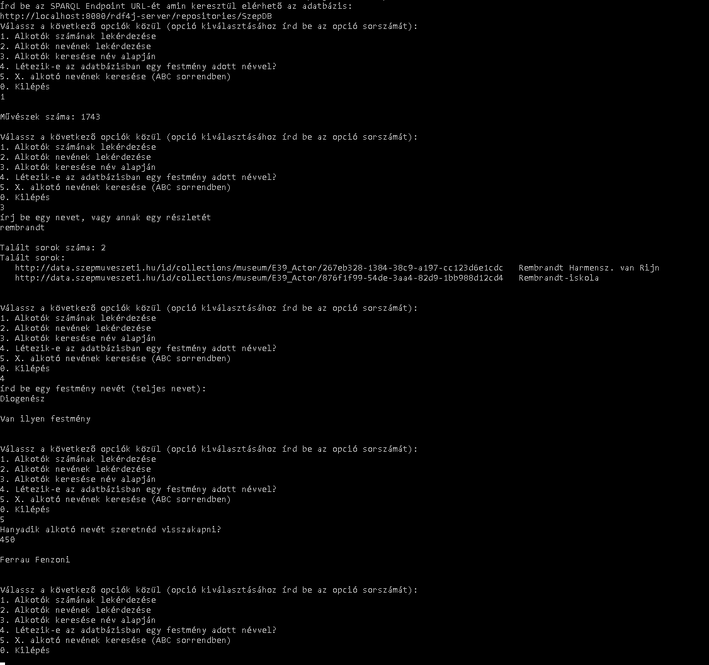

# Feladat: Manuális tesztek készítése (példa alkalmazás)

A feladat során készítettünk egy példa alkalmazást, aminek a segítségével példa query-ket lehet lefuttatni egy SPARQL endpoint-on, így egy általános képet kaphatunk a query-k és endpoint-ok használatáról.\
A query-ket érdemes egymás után futtatni, mivel egy adott query épít az előtte lévőkre.

## Alkalmazás használata

Ahogy elindítjuk az alkalmazást, meg kell adnunk a használni kívánt endpoint URL-ét (RDF4J workbench -> Summary ->Location), majd pedig választani kell a felajánlott query opciók közül.
Minden opcióhoz mellékelve van az annak megfelelő SPARQL query, amivel ellenőrizni lehet, hogy valóban jó adatokat ad vissza az alkalmazás.

## Query opciók:

###  Alkotók számának lekérdezése
Ez a query visszaadja az adatbázisban található alkotók számát.

SPARQL query:

`PREFIX ecrm: <http://erlangen-crm.org/current/>`\
`SELECT (Count(*) as ?actorCount) {`\
 `?actor rdf:type ecrm:E39_Actor;`\
`}`

### Összes alkotó nevének lekérdezése
Ez a query visszaadja az alkotók nevét, és a névhez tartozó alkotót.
Megjeleníteni csak az első 100 nevet jeleníti meg, az átláthatóság miatt.

SPARQL query:

`PREFIX ecrm: <http://erlangen-crm.org/current/>`\
`PREFIX rdf: <http://www.w3.org/1999/02/22-rdf-syntax-ns#>`\
`SELECT ?actor ?actorName {`\
`?actor rdf:type ecrm:E39_Actor .`\
 `?actor ecrm:P131_is_identified_by ?actorAppellation.`\
  `?actorAppellation rdf:type ecrm:E82_Actor_Appellation.`\
  `?actorAppellation ecrm:P3_has_note ?actorName;`\
`} ORDER BY (?actorName)`

### Alkotók keresése név alapján
Ennek a query-nek a segítségével egy név/névrészlet alapján lehet lekérni az adatbázisban szereplő alkotókat.\
Inputként meg kell adni a keresendő nevet/névrészletet.\
Az előző query-hez hasonlóan az alkotókat, és az alkotóhoz tartozó nevet adja vissza.

SPARQL query:

#ALKOTÓ NEVE# - ide kell beilleszteni a névrészletet

`PREFIX ecrm: <http://erlangen-crm.org/current/>`\
`PREFIX rdf: <http://www.w3.org/1999/02/22-rdf-syntax-ns#>`\
`SELECT ?actor ?actorName {`\
` ?actor rdf:type ecrm:E39_Actor .`\
` ?actor ecrm:P131_is_identified_by ?actorAppellation.`\
`  ?actorAppellation rdf:type ecrm:E82_Actor_Appellation.`\
`  ?actorAppellation ecrm:P3_has_note ?actorName;`\
`    FILTER regex(?actorName, "#ALKOTÓ NEVE#", "i")`\
`} ORDER BY (?actorName)`

### Létezik-e az adatbázisban egy festmény adott névvel?
Ennek a query-nek meg kell adni egy festmény nevét és visszaadja, hogy létezik-e ilyen nevű festmény az adatbázisban (teljes nevet kell megadni).

SPARQL query:

#FESTMÉNY NEVE# - ide kell beilleszteni a festmény teljes nevét

`PREFIX rdf: <http://www.w3.org/1999/02/22-rdf-syntax-ns#>`\
`PREFIX rdfs: <http://www.w3.org/2000/01/rdf-schema#>`\
`PREFIX ecrm: <http://erlangen-crm.org/current/>`\
`ask {`\
` ?thing rdf:type ecrm:E18_Physical_Thing.`\
` ?thing rdfs:label ?label`\
`    FILTER regex(?label, "^#FESTMÉNY NEVE#$", "i")`\
`}`

### ABC sorrendben X. alkotó nevének lekérése

Ennek a query-nek meg kell adni, hogy ABC sorrendben hanyadik alkotó nevét szeretnénk lekérni, és a query visszaadja az adott sorszámú alkotó nevét.

SPARQL query:

Ennél az opciónál az SPARQL query 0-tól indexelődik, az alkalmazásban lévő opció pedig 1-től.

#ALKOTÓ SORSZÁMA# - ide kell beilleszteni az alkotó sorszámát

`PREFIX ecrm: <http://erlangen-crm.org/current/>`\
`PREFIX rdf: <http://www.w3.org/1999/02/22-rdf-syntax-ns#>`\
`SELECT ?actorName {`\
` ?actor rdf:type ecrm:E39_Actor .`\
` ?actor ecrm:P131_is_identified_by ?actorAppellation.`\
`  ?actorAppellation rdf:type ecrm:E82_Actor_Appellation.`\
`  ?actorAppellation ecrm:P3_has_note ?actorName;`\
`} ORDER BY (?actorName) LIMIT 1  OFFSET #ALKOTÓ SORSZÁMA#`

## Az alkalmazás futás közben

A program futására látható itt egy példa a tárgy során megismert szépművészeti adatbázist használva:

