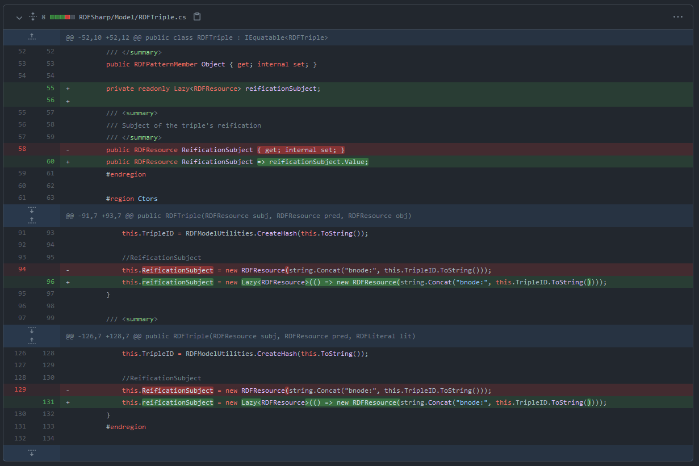

# Nem-funkcionális jellemzők vizsgálata (teljesítmény)

A feladat részeként az RDFSharp különböző fájl beolvasóinak teljesítményét szerettem volna összehasonlítani. Ebből esetlegesen kiderülhet, melyiket érdemes fejleszteni.

## Teszt adatok

A mérés elvégzéséhez szükségem volt tesz bemenetekre az RDFSharp által támogatott formátumokban (NTriples, RdfXml, TriX, Turtle). Forrásként a DBPedia ontológiájának leírását választottam, ami XML formátumban elérhető. (https://wiki.dbpedia.org/Downloads2014)

Az adatok megfelelő formátumokra konvertálásához készítettem egy egyszerű parancssori alkalmazást, ami beolvassa, majd ismét elmenti a bemenő fájlt, az RDFSharp szerializálói segítségével. Az RdfXml teszt adatokat is átfuttam ezen a programon.

Az adatok ellenőrzése közben fény derült az RDFSharp néhány gyengeségére. A DBPedia ontológia tartalmazott egy URI-t, amiben `<` és `>` karakterek szerepeltek. (http://dbpedia.org/ontology/%3Chttp://purl.org/vocab/bio/0.1/Birth%3E) Ezeket az RDFSharp egyik fájl írója sem kezelte helyesen.

A Turtle szerializáló nem képes a literálok végén található `"` karakter megfelelő kezelésére. A `"` karaktert tartalmazó literálokat mindig a `"""` szekvenciával jelöli, így ebben az esetben a literál túl hamar záródik le, utána keletkezik egy váratlan `"`.

Ezen hibák javítása túlmutat a jelen feladaton, a tesz adatokat kézzel javítottam.

## A teljesítmény mérése

Pontos teljesítmény adatok szerzéséhez a BenchmarkDotNet keretrendszert használtam. Egy teszt estet hoztam létre, ami mind a négy bemeneti formátumra lefut egyszer.

A teszt lényegi része:

```RDFGraph graph = RDFGraph.FromStream(InputFile.format, inputDataNoDispose);```

Hogy a teljesítményt ne befolyásolja a háttértár sebessége, a bemenő fájlt a tesz elején betöltöttem egy MemorySteam-be. Mivel az RDFSharp beolvasói alapértelmezetten lezárják a kapott Stream-et, és ezt a viselkedést nem lehet kikapcsolni, a teszthez létre kellett hoznom egy proxy osztályt, ami megakadályozza a MemoryStream lezárását.

A bemeneti fájlokat a benchmark projektben ZIP formátumban tömörítve tárolom, így a méretük nagyjából tizedére csökkenthető.

## Benchmark eredmények

A tesztet egy Intel i5-7600K processzoron futtatam.


|       InputFile |         Mean |       Error |       StdDev |
|---------------- |-------------:|------------:|-------------:|
| **NTriples**    | **434.9 ms** | **8.49 ms** | **11.62 ms** |
| **RdfXml**      | **312.6 ms** | **6.17 ms** | **12.03 ms** |
| **TriX**        | **340.9 ms** | **6.66 ms** |  **6.84 ms** |
| **Turtle**      | **457.1 ms** | **8.74 ms** |  **8.18 ms** |

Az összes formátum olvasása 500ms alatt megtörtént, ami szubjektíven nézve, a bemeneti fájl méretére tekintettel, elfogadható eredmény.

Az RdfXml és TriX formátumok észrevehetően gyorsabbak voltak. Ez érthető, hiszen ezek a szerializálók az XmlDocument osztályt használják beolvasásra, míg a másik kettő manuális string manipulációt alkalmaz.

## Teljesítmény javítása

A teljesítmény javítás lehetséges módjának meghatározására a PrefView eszközt használtam. Megvizsgáltam a benchmark lefutását az NTriples és RdfXml bemenetekre.

Az NTriples esetén sok időbe telik különböző reguláris kifejezések futtatása, ezek optimalizálása igen nehéz feladat.

A legtöbb idő mindkét esetben az RDFTriple példányok létrehozásával telik. Ezen belül a legköltségesebb művelet az MD5 hash-ek létrehozása. A hashelés az MD5CryptoServiceProvider osztály segítségével történik. A .NET Framework-ben ennek komoly teljesítmény problémái vannak, .NET 5-ben azonban sokkal jobb a helyzet, nem valószínű hogy itt javítani lehet.

Emellett Minden RDFTriple létrehoz egy RDFResource példányt is, ami az állítás reifikációjakor szükséges. Ez ismételten egy MD5 hash számításával jár.


Ez a művelete a teljes olvasás kb. 5%-át teszi ki az NTriples esetben. A reifikáció nem feltétlenül egy gyakori művelet, a könyvtár legtöbb felhasználásához nagy valószínűséggel nem szükséges. Lusta inicializálást alkalmazva meg lehet spórolni az extra RDFResource létrehozását.



Amint az várható volt, az olvasás így nagyjából 5%-al gyorsabb lett.

|      InputFile |         Mean |       Error |      StdDev |
|--------------- |-------------:|------------:|------------:|
| **NTriples**   | **402.8 ms** | **7.65 ms** | **8.19 ms** |
| **RdfXml**     | **287.7 ms** | **2.99 ms** | **2.80 ms** |
| **TriX**       | **308.0 ms** | **3.79 ms** | **3.54 ms** |
| **Turtle**     | **419.1 ms** | **5.65 ms** | **5.01 ms** |